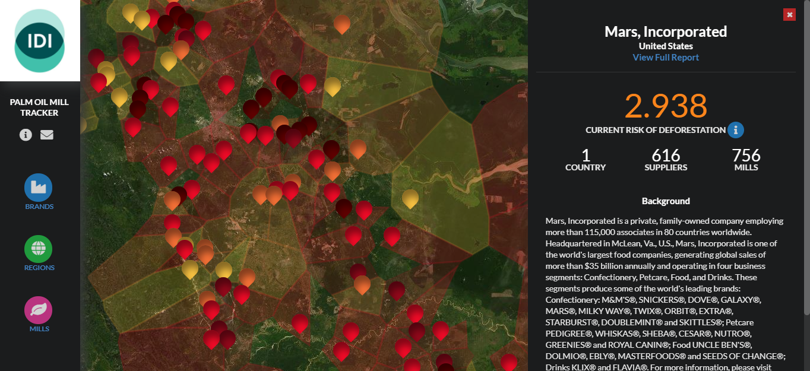

# Angular UI

This directory contains the project's single-page web application, the _IDI Palm Oil Tracker_. The app was built using [Angular](https://angular.io/) and scaffolded with [Angular CLI](https://github.com/angular/angular-cli) version 10.2.0.

## Contents  
* [Environment Setup](#Setting_Up_the_Environment)  
* [Developing with Angular](#Developing_with_Angular)  
* [Folder Overview](#"Folder_Overview")  

## Environment Setup

1.  [Download and install](https://nodejs.org/en/download/) Node.js if it is not already on your personal computer. The latest version includes the Node Package Manager (npm), which is used for development purposes. You can check that the installation completed successfully by opening a terminal and checking the package version: `npm -v`.

2. Navigate to the "angular-ui" project in your terminal.

3. Run `npm install`. This will locally install all of the node modules used by the project. These modules are not checked into source code.

4. Install the [Angular CLI](https://cli.angular.io/) using the command `npm install -g @angular/cli`.  This installs the package globally, which is [recommended](https://stackoverflow.com/questions/5817874/how-do-i-install-a-module-globally-using-npm?answertab=votes#tab-top) for command line tools because doing so places the package binaries within your PATH environmental variable.

5. Run the command `ng serve --open`.  This spins up a new instance of the Angular Live Development Server, which then bundles and compiles the app and launches an instance in a new Chrome browser tab. (Note: The backend Flask API server must be running simultaneously to send data to the app.) The app runs locally on port `4200`; saving code updates causes the server to automatically recompile and refresh the app in the browser.

## Developing with Angular

The CLI simplifies the development process by providing a series of common commands:

**Development server**: Run `ng serve` for a dev server. Navigate to `http://localhost:4200/`. The app will automatically reload if you change any of the source files.

**Code scaffolding**: Run `ng generate component component-name` to generate a new component. You can also use `ng generate directive|pipe|service|class|guard|interface|enum|module`.

**Build**: Run `ng build` to build the project. The build artifacts will be stored in the `dist/` directory. Use the `--prod` flag for a production build.

**Running unit tests**: (_Note: Not currently being utilized_) Run `ng test` to execute the unit tests via [Karma](https://karma-runner.github.io).

**Running end-to-end tests**: (_Note: Not currently being utilized_) Run `ng e2e` to execute the end-to-end tests via [Protractor](http://www.protractortest.org/).

**Further help**: To get more help on the Angular CLI use `ng help` or go check out the [Angular CLI Overview and Command Reference](https://angular.io/cli) page.

## Folder Overview

Many files were generated as part of the Angular CLI scaffolding process. However, the main "action" occurs under `angular-ui/src/app`.

### First Level

* **e2e**: Folder containing the end-to-end tests for the application. (Not currently used or implemented by the team.)

* **semantic**: Folder containing a copy of the [Semantic UI](https://semantic-ui.com/kitchen-sink.html) JavaScript library.  This should be fixed/adjusted in the future so the project only uses Semantic through imported node modules.

* **src**: Folder containing the source files and logic for the application.

* **angular.json**: The Angular project configuration file.

* **karma.conf.json**: The configuration file for the Karma unit tests.

* **package.lock.json**: Automatically generated for any operations where `npm` modifies either the `node_modules` tree, or `package.json`. It describes the exact tree that was generated, such that subsequent installs are able to generate identical trees, regardless of intermediate dependency updates. (_Source: Node.js [docs](https://docs.npmjs.com/cli/v6/configuring-npm/package-lock-json)_) 

* **package.json**: Holds various metadata relevant to the project. This file is used to give information to npm that allows it to identify the project as well as handle the project's dependencies. It can also contain other metadata such as a project description, the version of the project in a particular distribution, license information, even configuration data - all of which can be vital to both npm and to the end users of the package. (_Source: Node.js's "[Getting Started](https://nodejs.org/en/knowledge/getting-started/npm/what-is-the-file-package-json/)" Section_)

* **tsconfig.****.json**: TypeScript compiler configuration files for the Angular project and its tests.

* **tslint.json**: Tool that checks TypesCript code for readability, maintainability, and functionality errors. (_Source: [TSLint docs](https://palantir.github.io/tslint/)_)

### Second Level: "src" Folder

* **app**: Folder containing the main application code.

* **assets**: Folder containing images and icons used in the site.

* **environment**: Folder containing configuration files with variables specific to each deployment environment (e.g. "dev", "prod").

* **index.html**: The root HTML document for the Angular app.

* **main.ts**: Responsible for bootstrapping the application and controlling the start-up.

* **polyfills.ts**: Makes the app compatible for different browsers.

* **styles.css**: The global style sheet for the Angular app.

* **test.ts**: Used by the Karma testing framework to load the test (.spec) and framework files.

### Third and Fourth Levels: "app" Folder and Children

* **components**: Folder containing the Angular components used to build the site. (Note: All these components are children of the main "app" component described later below.) 

  * "about": the "About" modal window
  * "box-and-whisker-plot": reusable box-and-whisker-plots
  * "brand": a summary view of a consumer brand
  * "brand-agg-tree-loss-chart": a line chart showing aggregate tree loss over time for brands
  * "brand-agg-stats": a view showing aggregate statistics across brands
  * "brand-filter": a view used to filter the map and data to that of one brand
  * "brand-report": a detailed view of a consumer brand
  * "map": a Leaflet map instance display UML mills and their computed boundaries
  * "nav": the navigation bar

* **interfaces**: Folder containing TypeScript interfaces used throughout the site

* **services**: Folder containing TypeScript services used throughout the site
  * "api.service.ts": provides Angular components access to resources from backend API

* **app-routing.module.ts**: Handles in-app navigation.

* **app.component.ts**: The main/parent Angular app component.

* **app.component.html**: The style sheet for the main app component.

* **app.module.ts**: The root module for the app. In Angular, modules group components into a cohesive block of code that can be shared with other modules.

